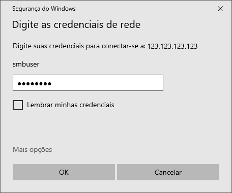

# How to access your server's files from Windows Explorer

## On the server:

First, install SAMBA:

```bash
sudo apt install samba
```

Then edit `/etc/samba/smb.conf` to make sure those are there:

```bash
# Change this to the workgroup/NT-domain name your Samba server will part of
   workgroup = WORKGROUP
   wins support = yes
```

```bash
[WinShare] # The name of your share service
   comment=Windows Explorer Share
   path=/ # The path you want to share
   browseable=Yes
   writeable=Yes
   only guest=no
   create mask=0777
   directory mask=0777
   public=no # If you can login without credentials or not
```

Unless you made `public=yes`,  you'll need to create a SAMBA user:

```bash
sudo smbpasswd -a smbuser
```

After entering your chosen password twice your user is successfully configured.

Remember to check, in case you have a firewall enabled, if the port 445 is allowed.

Now everything server-side is done!


## On the client:

On the client's Windows Explorer, right click on `This Computer` and then on `Map network unit`:


Then choose the letter you want to assign, enter your credentials in a `\\hostname\share_service` format and check both boxes:



Finally, after that, a screen will appear asking for your credentials - the user and password configured with `smbpasswd` in the server.