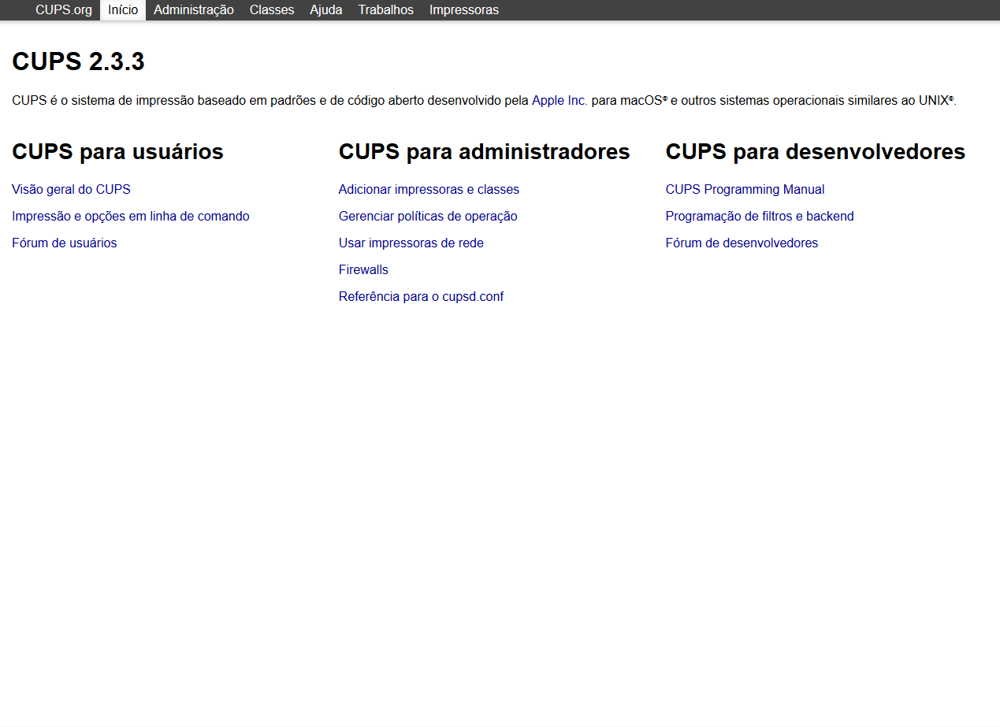
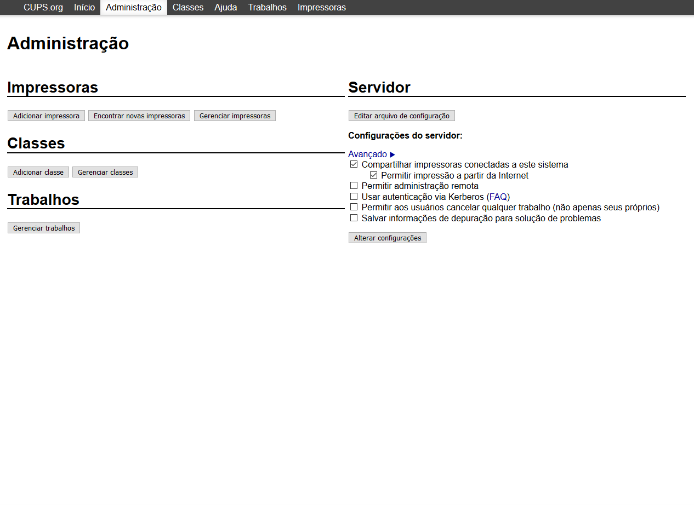
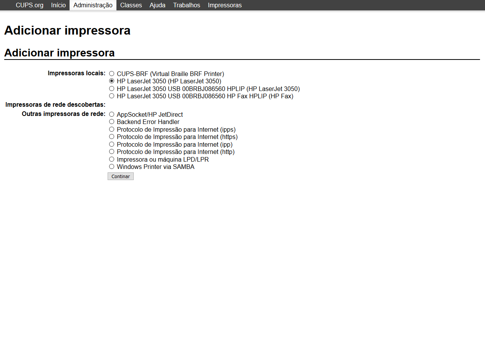
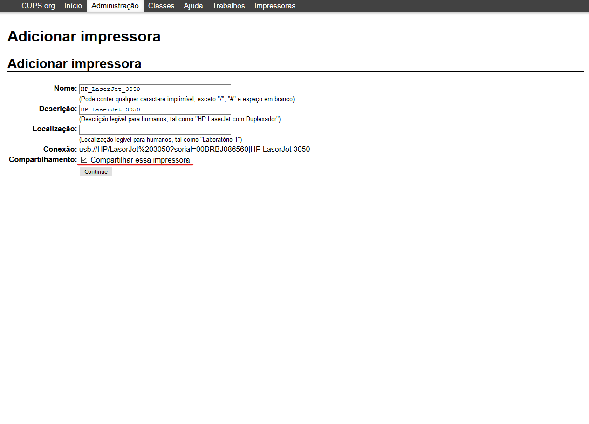
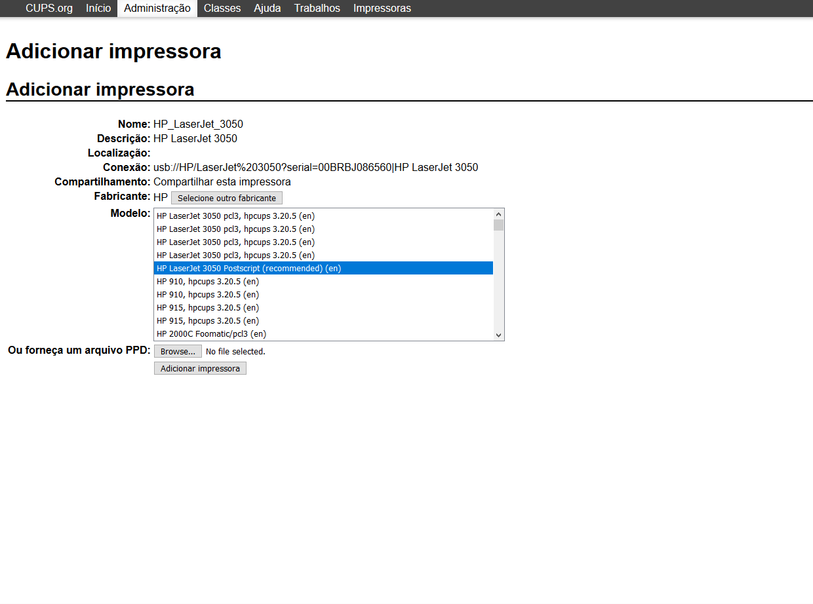

# How to configure any printer as a WiFi printer with CUPS

## Configuring CUPS and SAMBA:

First you need to install CUPS and SAMBA:

```bash
sudo apt install cups samba
```

Then, allow CUPS administration page to be accessed by another computer:

```bash
sudo cupsctl --remote-any
```

Optionally, if you want to access CUPS' administive functions by a user other than `root`, you can with:

```bash
sudo usermod -a -G lpadmin user
```

You also need to edit your `/etc/samba/smb.conf` to have everything as below:

```bash
[printers]
   comment = All Printers
   browseable = no
   path = /var/spool/samba
   printable = yes
   guest ok = yes
   read only = yes
   create mask = 0700

# Windows clients look for this share name as a source of downloadable
# printer drivers
[print$]
   comment = Printer Drivers
   path = /var/lib/samba/printers
   browseable = yes
   read only = no
   guest ok = no
```

To apply the changes, restart CUPS and SAMBA services:

```bash
sudo systemctl restart cups
sudo systemctl restart smbd
```

Remember to check, in case you have a firewall enabled, if the port 631 is allowed.


## Configuring the printer on the administrative panel:

If you’re unsure what your IP address, use:

```bash
hostname -I
```

Go to your web browser and access `http://{your_ip}:631`:



Click the `Administrator` tab and enter your credentials. You'll land on:



Click on `Add printer` on `Printers` section and select your printer:



Choose the name of your printer and remember to check the `Share this printer` box:



Select your printers driver and click on `Add printer`:



Done! Now you can print via WiFi :)